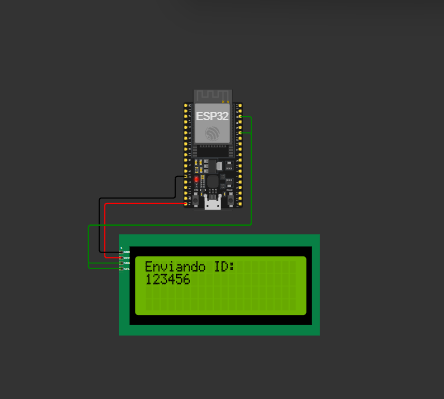
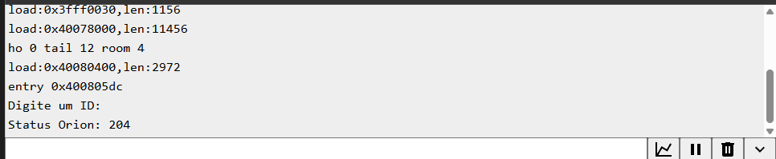
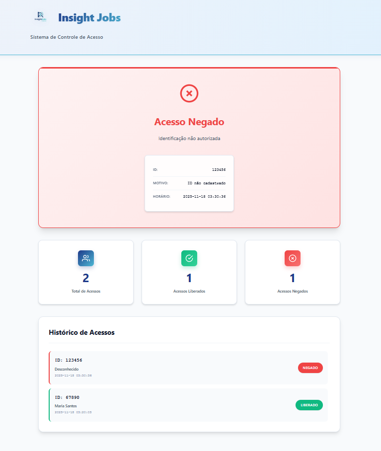

# 🚀 Insight Jobs: Sistema de Controle de Acesso Inteligente

O projeto **Insight Jobs** é um sistema de controle de acesso inteligente que integra hardware (simulado no Wokwi com ESP32 e LCD) e software (uma API em Flask e uma interface web) para monitorar e gerenciar tentativas de acesso em tempo real. A comunicação entre o hardware e o software é realizada através da plataforma **FIWARE Orion Context Broker**, seguindo os princípios da Internet das Coisas (IoT) e Cidades Inteligentes.

O objetivo principal é simular um sistema robusto onde um dispositivo de campo (ESP32) envia uma identificação (ID) para a nuvem (FIWARE), e um sistema de backend (API Flask) consome essa informação, processa a lógica de acesso (liberado ou negado) e, em seguida, atualiza o contexto no FIWARE, que pode ser lido de volta pelo dispositivo ou visualizado em uma interface de monitoramento.

## ⚙️ Arquitetura do Sistema

A solução é dividida em três componentes principais que interagem de forma assíncrona através do FIWARE Orion Context Broker:

| Componente | Tecnologia | Função Principal |
| :--- | :--- | :--- |
| **Dispositivo de Campo (Simulação)** | Arduino/C++ (ESP32) | Captura e envia o ID de acesso para o FIWARE. Exibe o status no LCD. |
| **Context Broker** | FIWARE Orion | Atua como o ponto central de coleta e distribuição de dados de contexto em tempo real. |
| **Backend e Frontend** | Python (Flask), HTML, CSS, JavaScript | Monitora o FIWARE, processa a lógica de acesso, armazena o histórico e exibe o painel de controle. |

### Fluxo de Dados

1.  O usuário insere um ID no monitor serial do **ESP32 (Wokwi)**.
2.  O código do ESP32 envia o ID para a entidade `TesteESP32` no **FIWARE Orion** via requisição HTTP `PATCH`.
3.  A **API Flask** monitora continuamente a entidade `TesteESP32` no FIWARE.
4.  Ao detectar um novo ID, a API Flask verifica se o ID está na lista de IDs autorizados.
5.  A API Flask atualiza a entidade no FIWARE com o resultado do acesso (`statusAcesso`, `nomeUsuario`, `departamento`).
6.  A **Interface Web** consome as APIs do Flask para exibir o status do último acesso, estatísticas e histórico em tempo real.

## 💻 Tecnologias Utilizadas

Este projeto utiliza um conjunto de tecnologias modernas para simular um ambiente de IoT completo:

| Categoria | Tecnologia | Descrição |
| :--- | :--- | :--- |
| **Hardware/Firmware** | **ESP32** | Microcontrolador utilizado para simular o dispositivo de campo. |
| | **Arduino/C++** | Linguagem de programação e ambiente de desenvolvimento para o ESP32. |
| | **LiquidCrystal_I2C** | Biblioteca para controle do display LCD 16x2. |
| | **WiFi.h, HTTPClient.h** | Bibliotecas para conectividade de rede e requisições HTTP. |
| **Plataforma IoT** | **FIWARE Orion Context Broker** | Componente essencial para gerenciar e compartilhar informações de contexto em tempo real. |
| **Backend** | **Python (Flask)** | Framework web leve para construir a API de controle de acesso e monitoramento do FIWARE. |
| | **`requests`** | Biblioteca Python para fazer requisições HTTP ao FIWARE. |
| **Frontend** | **HTML5, CSS3, JavaScript** | Tecnologias padrão para a construção da interface de monitoramento web. |
| | **CORS** | Configuração no Flask para permitir a comunicação entre o frontend e o backend. |

## 👥 Integrantes do Grupo

O projeto foi desenvolvido pelos seguintes membros do grupo:

| Nome | RM |
| :--- | :--- |
| Kelwin Silva | 566348 |
| Pedro Almeida | 564711 |
| João Paulo | 565383 |

## 🛠️ Passo a Passo para Teste

Para testar o sistema, você precisará simular o ambiente do ESP32 (Wokwi) e executar o backend (API Flask) localmente.

### 1. Configuração do Backend (API Flask)

O backend é responsável pela lógica de acesso e pela interface de monitoramento.

1.  **Pré-requisitos:** Certifique-se de ter o **Python 3** instalado.
2.  **Instalar Dependências:** Navegue até o diretório do projeto e instale as bibliotecas necessárias:
    ```bash
    pip install -r requirements.txt
    ```
3.  **Executar a API:** Inicie o servidor Flask. Ele começará a monitorar o FIWARE e servirá a interface web na porta `5000`.
    ```bash
    python app.py
    ```
    Você verá a saída no console indicando que o monitoramento do FIWARE foi iniciado e a interface web está disponível.

4.  **Acessar a Interface Web:** Abra seu navegador e acesse:
    ```
    http://localhost:5000
    ```
    A interface de monitoramento será carregada, exibindo o status atual, estatísticas e histórico.

### 2. Simulação do Dispositivo (Wokwi - ESP32)

O código do ESP32 simula o envio do ID de acesso.

1.  **Acessar o Wokwi:** O código fornecido é para o simulador Wokwi. Você pode criar um novo projeto ESP32 e colar o código `wokwi: #include <Wire.h> ...` no arquivo `main.ino`.
2.  **Verificar o Circuito:** O circuito deve incluir um **ESP32** e um **LCD I2C 16x2**, conforme a imagem de referência:

    

3.  **Iniciar a Simulação:** Clique no botão "Start Simulation". O ESP32 irá se conectar à rede `Wokwi-GUEST`.
4.  **Enviar IDs de Teste:** Use o **Monitor Serial** do Wokwi para enviar os IDs.

    *   **ID Autorizado (Acesso Liberado):** Digite `12345` e pressione Enter.
    *   **ID Não Autorizado (Acesso Negado):** Digite `00000` e pressione Enter.

    O LCD exibirá o ID enviado, e o Monitor Serial mostrará o status da requisição HTTP para o FIWARE (espera-se um `Status Orion: 204` para sucesso).

    

### 3. Verificação do Resultado

Ao enviar um ID pelo Wokwi, o resultado deve ser instantaneamente refletido em dois lugares:

1.  **Console da API Flask:** O console da API Flask (`python app.py`) deve exibir a mensagem de **ACESSO LIBERADO** ou **ACESSO NEGADO**, indicando que o backend recebeu e processou o ID do FIWARE.
2.  **Interface Web:** A página `http://localhost:5000` deve atualizar automaticamente:
    *   O **Status Card** mudará para verde (Liberado) ou vermelho (Negado), exibindo os detalhes do usuário.
    *   As **Estatísticas** (Total, Liberados, Negados) serão incrementadas.
    *   O **Histórico de Acessos** listará a nova tentativa.

## 🖼️ Imagens do Projeto

| Descrição | Imagem |
| :--- | :--- |
| **Logo do Projeto** |  |
| **Simulação do Circuito Wokwi** |  |
| **Saída do Monitor Serial (Wokwi)** |  |
| **Exemplo da Interface Web (Acesso Negado)** |  |
